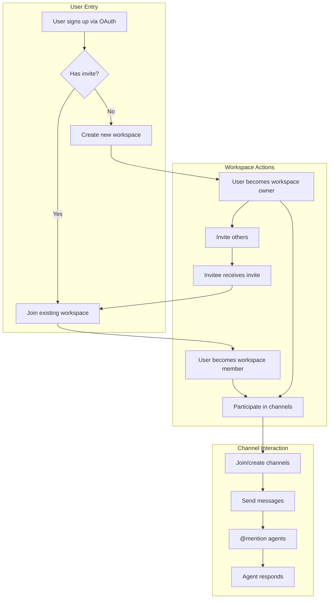
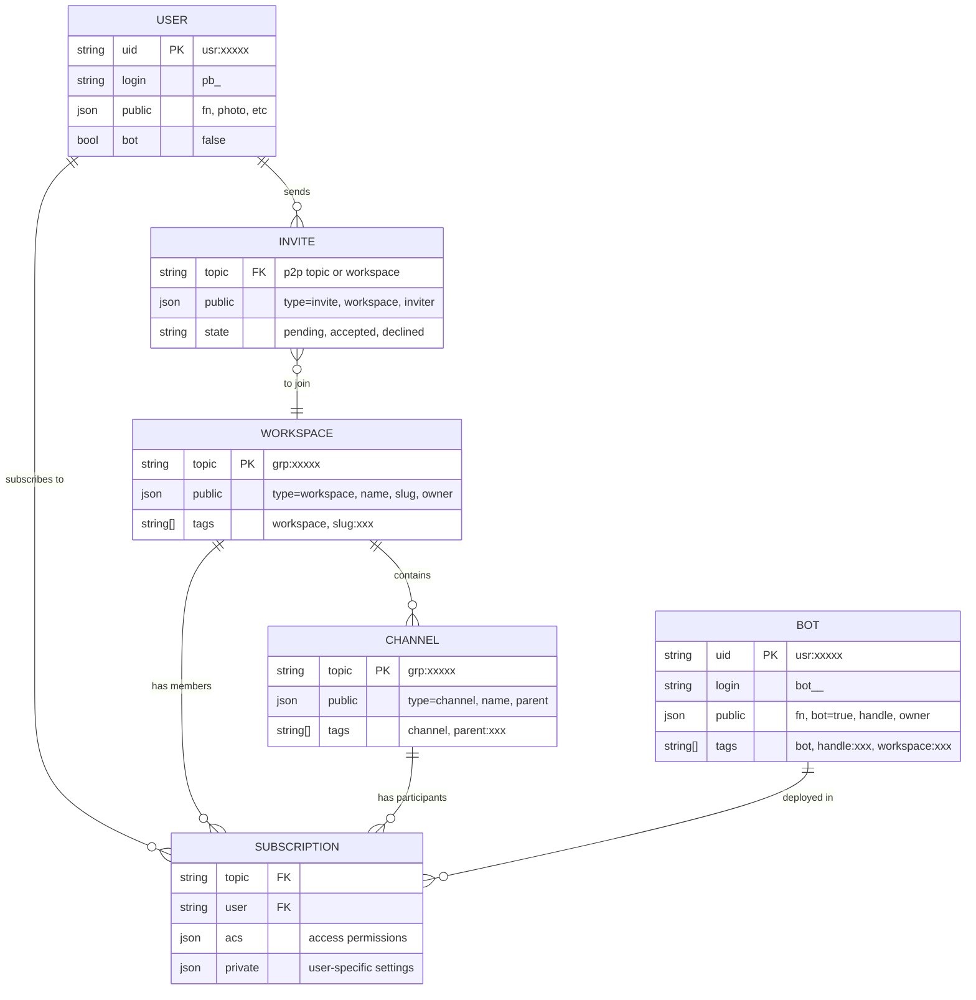
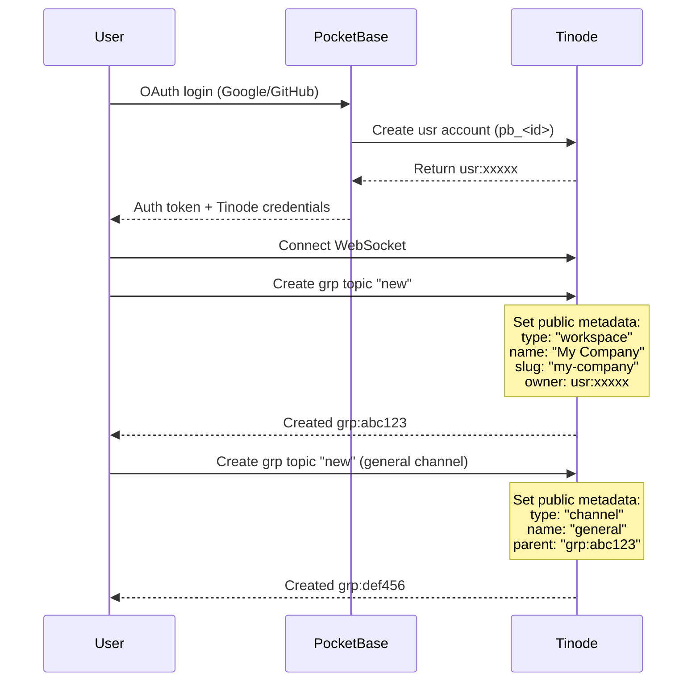
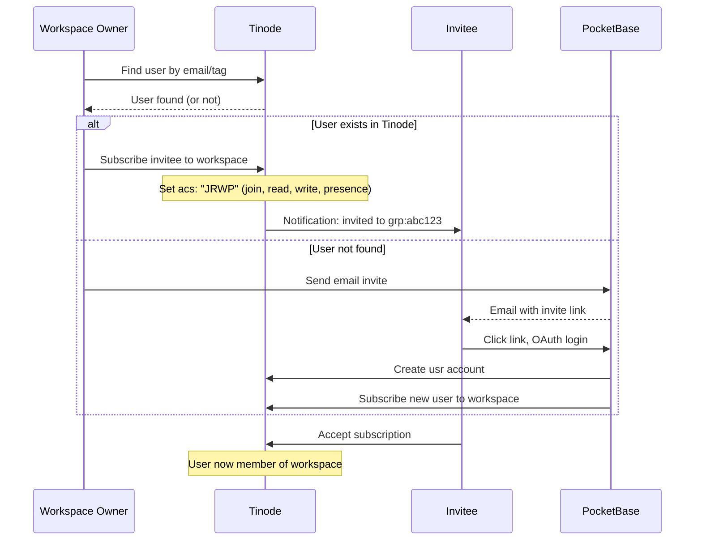
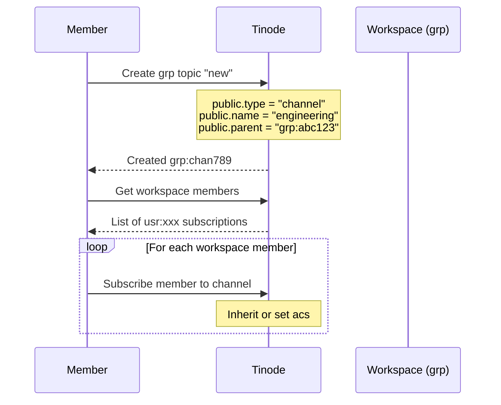
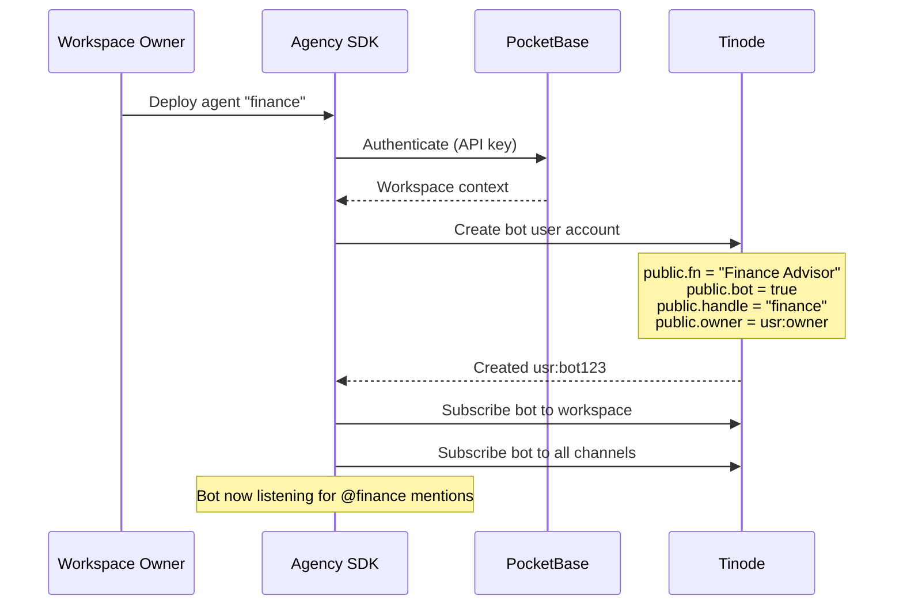

# Tinode Schema: User Journey & Data Model

## User Journey Overview



## Tinode Entity Relationships



## Detailed Flows

### 1. New User Creates Workspace



### 2. Invite User to Workspace



### 3. Channel Creation & Membership



### 4. Agent Bot Deployment



## Metadata Reference

### Workspace (grp topic)
```json
{
  "public": {
    "type": "workspace",
    "name": "Acme Corp",
    "slug": "acme-corp",
    "owner": "usr:ABC123",
    "photo": "https://..."
  },
  "tags": ["workspace", "slug:acme-corp"]
}
```

### Channel (grp topic)
```json
{
  "public": {
    "type": "channel",
    "name": "engineering",
    "parent": "grp:workspace123",
    "description": "Engineering discussions"
  },
  "tags": ["channel", "parent:grp:workspace123"]
}
```

### Human User (usr account)
```json
{
  "public": {
    "fn": "John Doe",
    "photo": "https://...",
    "bot": false
  },
  "private": {
    "pocketbase_id": "pb_user_id"
  },
  "tags": ["email:john@example.com"]
}
```

### Agent Bot (usr account)
```json
{
  "public": {
    "fn": "Finance Advisor",
    "bot": true,
    "handle": "finance",
    "owner": "usr:ABC123",
    "description": "I help with financial questions"
  },
  "trusted": {
    "workspace": "grp:workspace123"
  },
  "tags": ["bot", "handle:finance", "workspace:grp:workspace123"]
}
```

### Subscription (membership)
```json
{
  "acs": {
    "want": "JRWPASDO",
    "given": "JRWP"
  },
  "private": {
    "nickname": "Johnny",
    "muted": false,
    "pinned": true
  }
}
```

## Access Control Reference

| Permission | Meaning |
|------------|---------|
| J | Join - can subscribe to topic |
| R | Read - can read messages |
| W | Write - can send messages |
| P | Presence - receive presence updates |
| A | Admin - can manage subscriptions |
| S | Sharer - can reshare access |
| D | Delete - can hard-delete messages |
| O | Owner - full control |

### Typical Access Patterns

| Role | Workspace | Channel |
|------|-----------|---------|
| Owner | JRWPASDO | JRWPASDO |
| Admin | JRWPAS | JRWPAS |
| Member | JRWP | JRWP |
| Bot | JRW | JRW |
| Guest | JR | JR |

## Discovery & Queries

### Find all workspaces for a user
```
Subscribe to "me" topic → Get list of subscriptions →
Filter where public.type = "workspace"
```

### Find all channels in a workspace
```
Query "fnd" topic with tags: ["parent:grp:workspace123"]
```

### Find all bots in a workspace
```
Query "fnd" topic with tags: ["bot", "workspace:grp:workspace123"]
```

### Find user by email
```
Query "fnd" topic with tags: ["email:user@example.com"]
```
